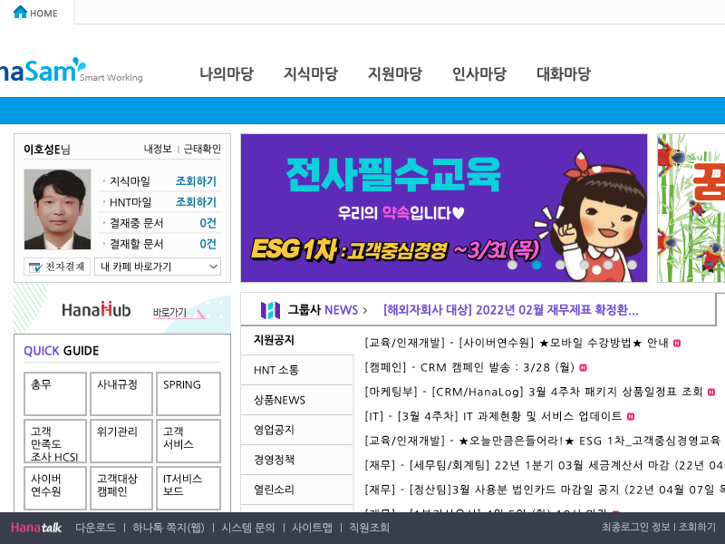

## HOW TO USE 

아래 명령어 실행 후 바탕화면에 오늘날짜.png 확인하기

- 사번, 비밀번호는 실행 시 입력 받고 있으며 코드를 보면 아시겠지만 별도로 갈취하지 않습니다. 


```
$ ID=HG318 PASS=mypassword node app.js 
```





#### 처음 사용시 

```
$ git clone https://git.hanatour.com/HG318/login_freedom.git
$ cd login_freedom 
$ npm install 
$ ID=hg318 PASS=mypassword node app.js 
```


### TODO 
- 이걸 쉘 스크립트로 만들어서 부팅 후 자동 실행 